```{r setup, include=FALSE}
options(htmltools.dir.version = FALSE)
knitr::opts_chunk$set(
  fig.width=9, fig.height=3.5, fig.retina=3,
  out.width = "100%",
  cache = FALSE,
  echo = TRUE,
  message = FALSE, 
  warning = FALSE,
  hiline = TRUE
)
```

```{r xaringan-themer, include=FALSE, warning=FALSE}
library(xaringanthemer)
style_mono_accent(
  base_color = "#081d58",
  text_bold_color = "#ce1256",
  title_slide_text_color = "#edf8b1",
  header_font_google = google_font("Josefin Sans"),
  base_font_size = "20px",
  text_font_size = "1.5rem"
 #text_font_google   = google_font("Montserrat", "300", "300i")
 # code_font_google   = google_font("Fira Mono")
)
```

## Research Outreach: Department of Statistics

--

- PhD thesis: 4-5 years

--
- MPhil thesis: 2-3 years 

--

- MSc thesis: 1 year

--

- BSc.(Hons) thesis: 6-8 months

--

- BSc. (Hons) internship: 4 months/ 6 months

--

- Independent study: 100 hours (over 15 weeks)

--

- Statistical consultancy: 100 hours (over 15 weeks)

---

## Research Outreach: Department of Statistics


- PhD thesis: 4-5 years


- MPhil thesis: 2-3 years 


- MSc thesis: 1 year


- **BSc.(Hons) thesis: 6-8 months**


- **BSc. (Hons) internship: 4 months/ 6 months**


- **Independent study: 100 hours (over 15 weeks)**


- **Statistical consultancy: 100 hours (over 15 weeks)**

---

## Research Outreach: Department of Statistics


- PhD thesis: 4-5 years


- MPhil thesis: 2-3 years 


- MSc thesis: 1 year


- BSc.(Hons) thesis: 6-8 months


- BSc. (Hons) internship: 4 months/ 6 months


- Independent study: 100 hours (over 15 weeks)


- **Statistical consultancy: 100 hours (over 15 weeks)**

---

## Statistical Consulting Service: How does it work?

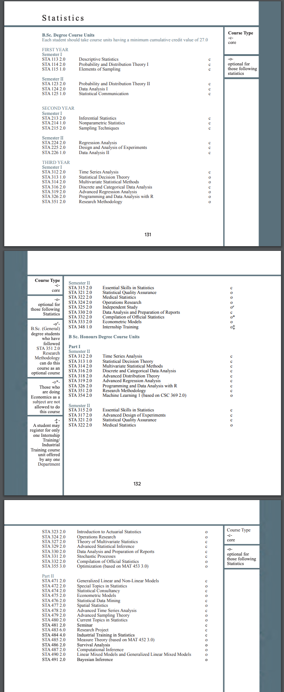

---
## Statistical Consulting Service: How does it work?

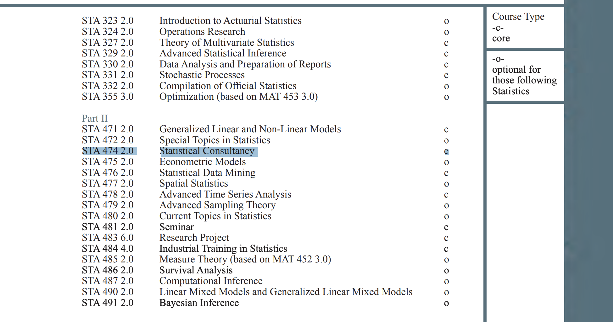

---

## STA 474 2.0 Statistical Consultancy - core unit

- 100 hours

    - 30 hours lecture 
    
    - 70 hours independent learning (meeting with clients/ consultants, data analysis)

- Time: **9 December 2022 - 10 March 2023**

---

### How do we operate?

Under the supervision of lecturers, final year B.Sc. Hons (Statistics) degree students provide assistance.

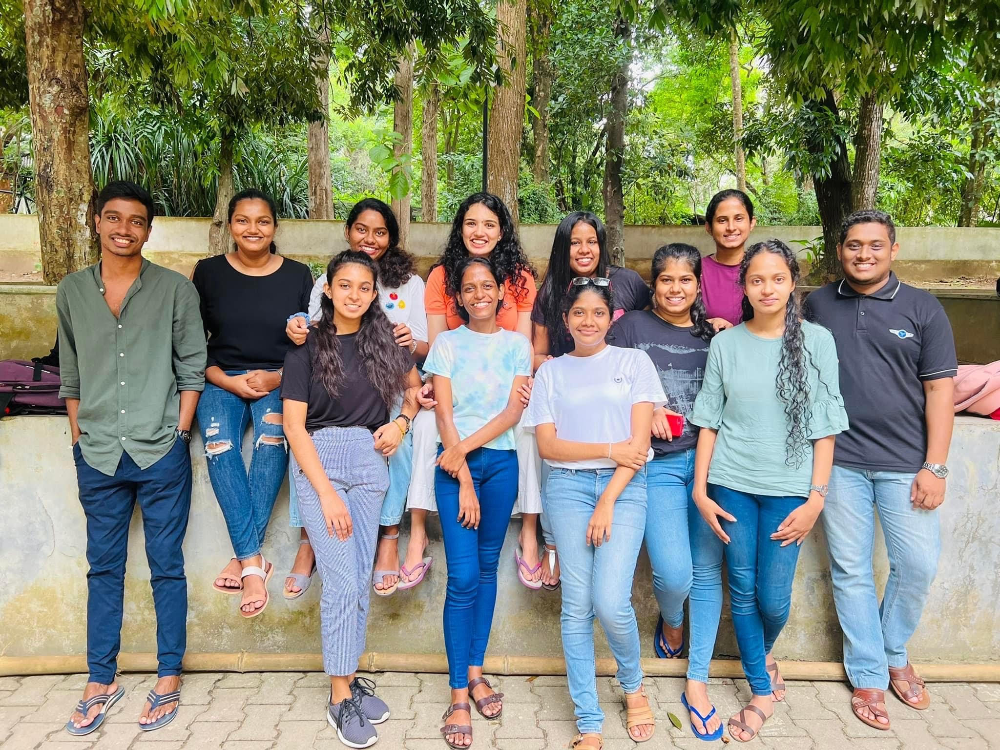


---
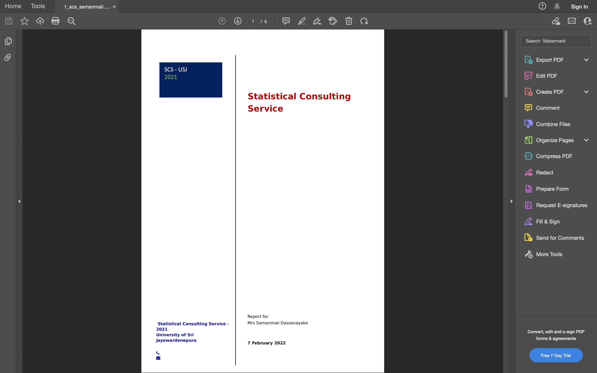

---
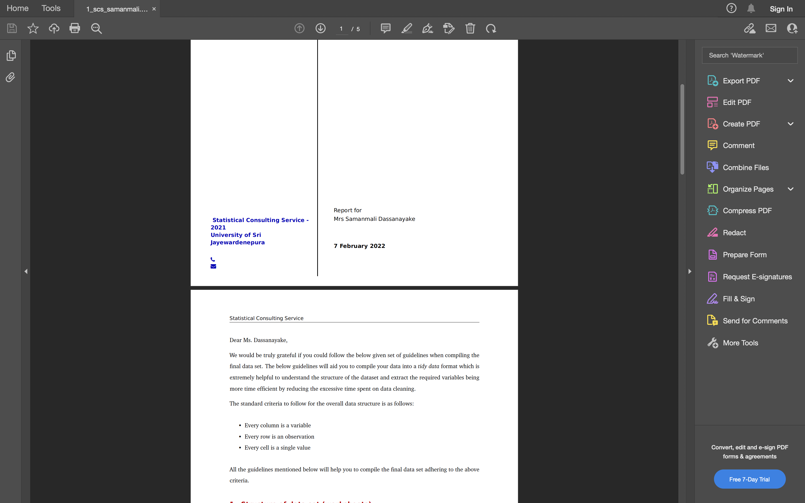

---

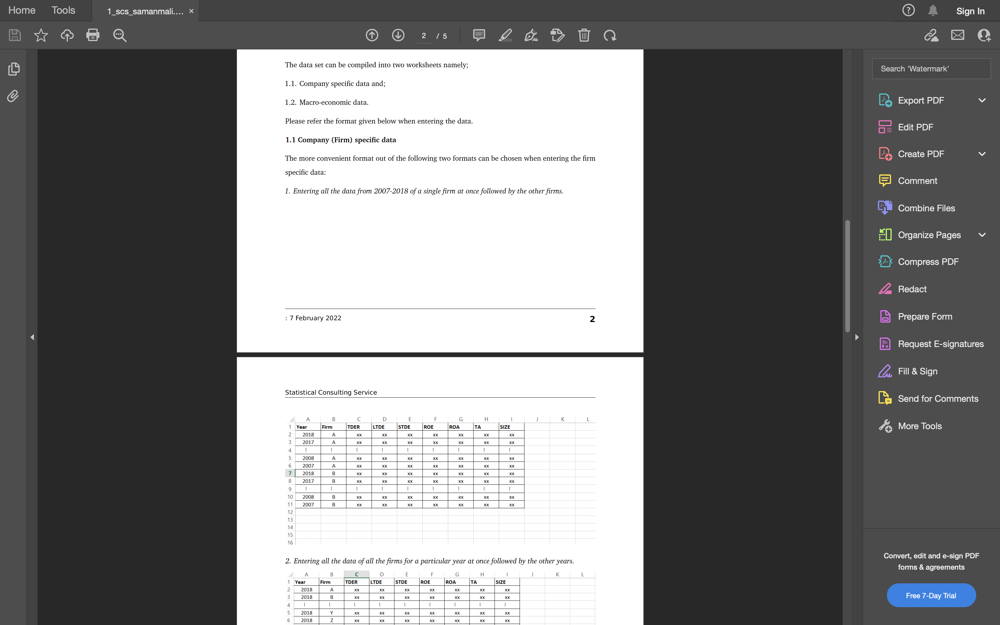

---

## Our services

.pull-left[
-  Questionnaire design 

- Experimental design 

- Sampling 

- Data cleaning 

- Descriptive analysis of the data 

- Estimation and hypothesis testing 

- Statistical modeling

]


.pull-right[


- Time series analysis 

- Interpretation of the statistical outputs 

- Statistical software helps

- Guidelines for the development of research proposals

- Product development (statistical tools/ dashboard)
 
]

---
class: middle, center, inverse

# Our products

---

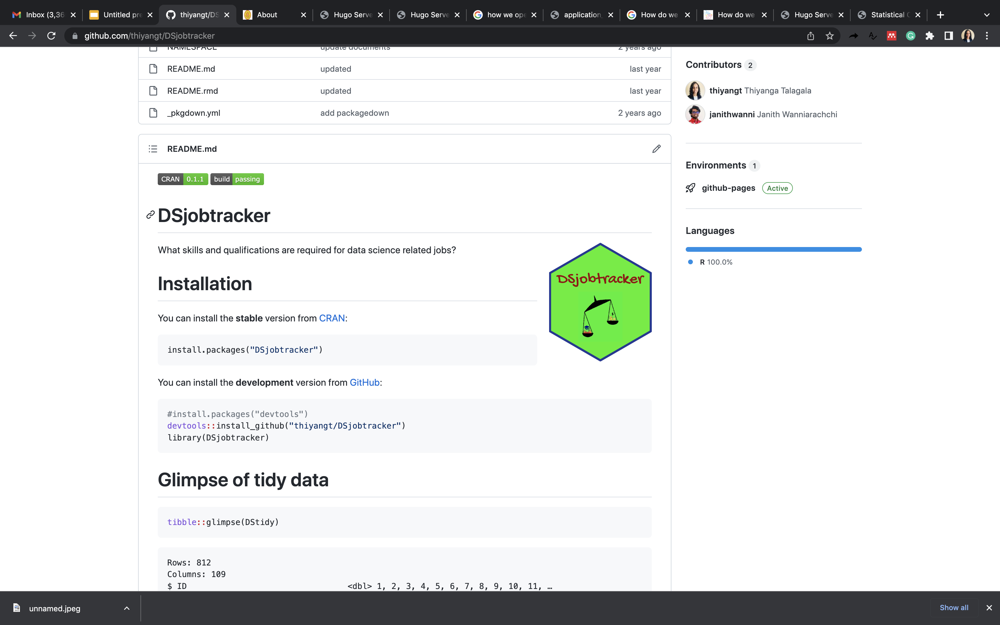

---

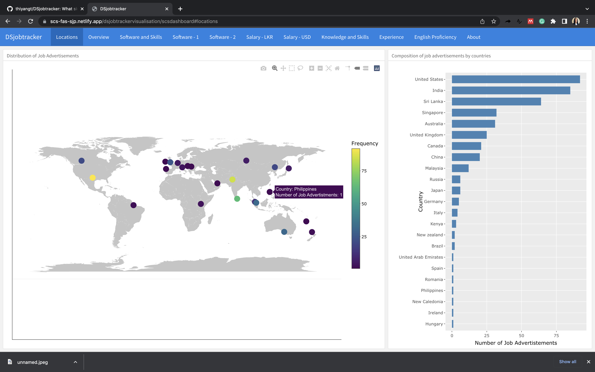

---

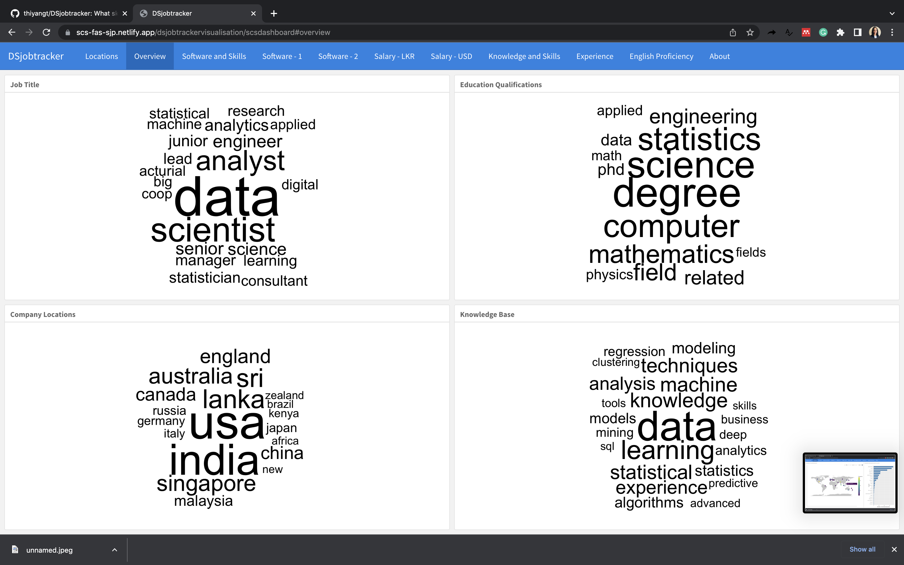

---


---

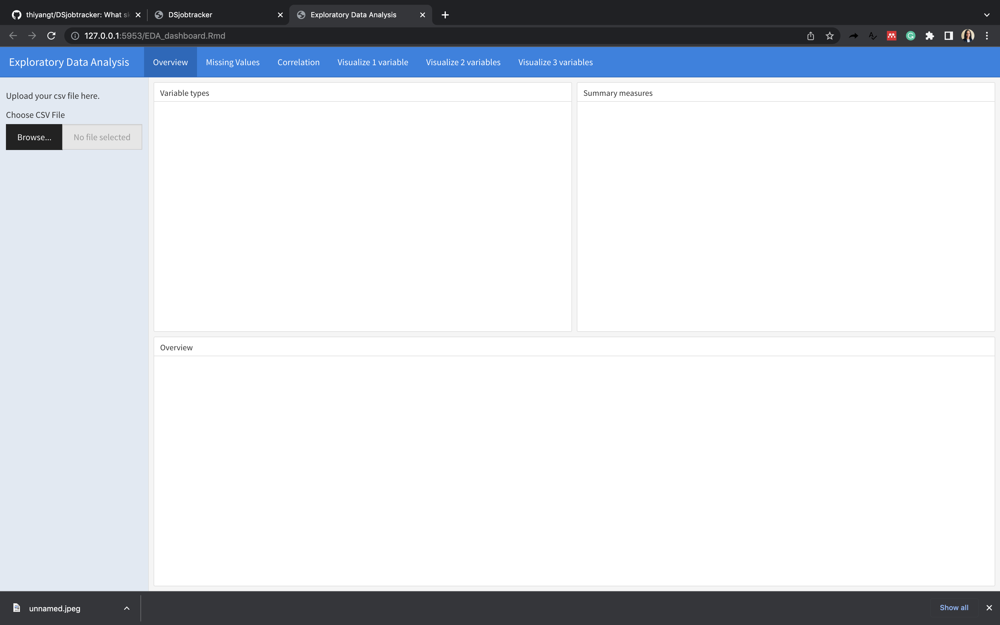

---

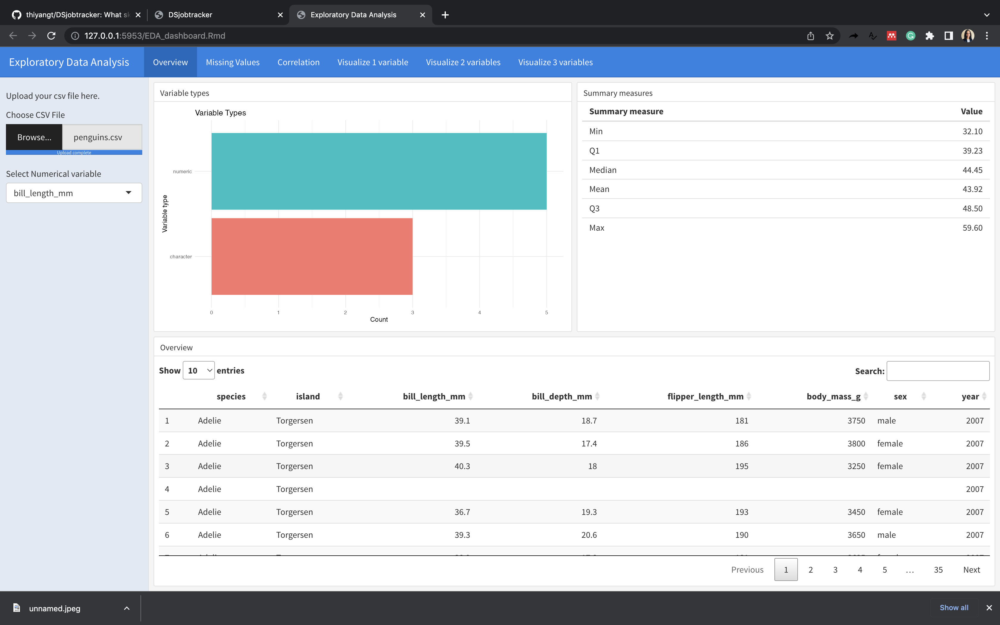

---

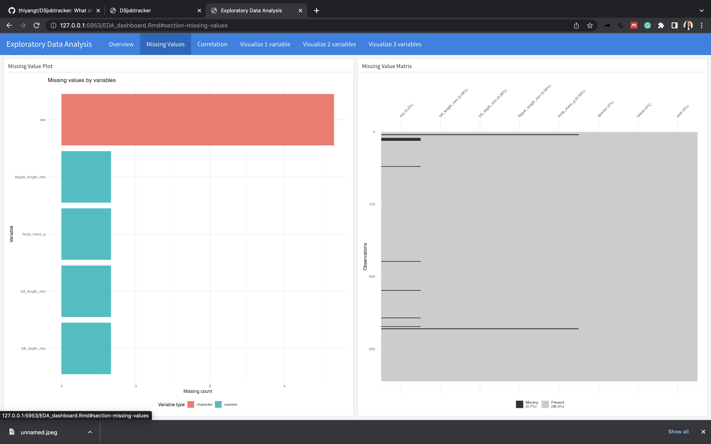
---

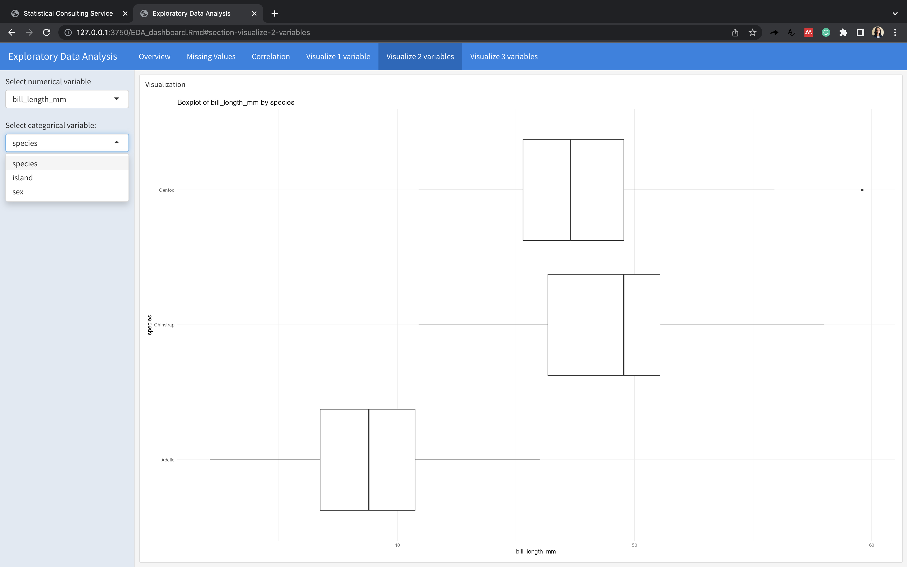

---

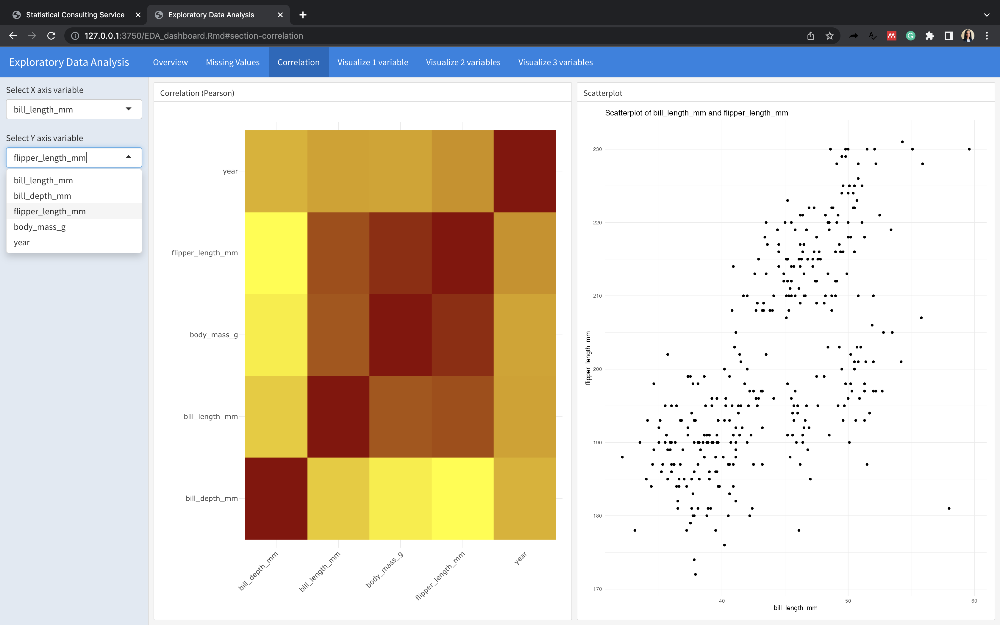


---

# For more information

Visit our website at: http://science.sjp.ac.lk/sta/scs-sjp/

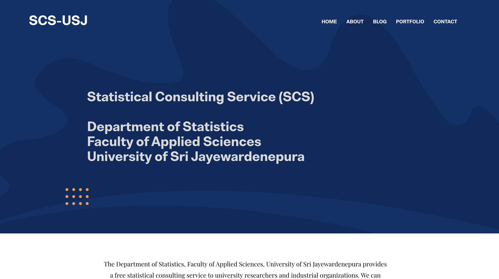

Contact: ttalagala@sjp.ac.lk

---

## Terms and conditions

In publications pertaining to their projects, clients should properly credit our services.

More information: https://scs-fas-sjp.netlify.app/about/

---

# For more information

Visit our website at: http://science.sjp.ac.lk/sta/scs-sjp/


