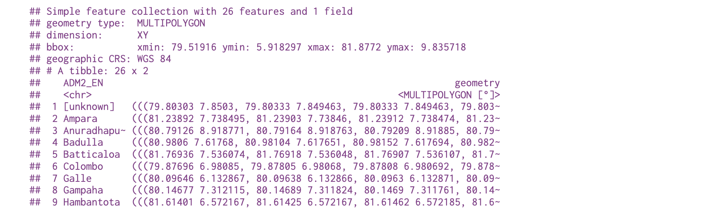

```{r setup, include=FALSE}
options(htmltools.dir.version = FALSE)
knitr::opts_chunk$set(
  fig.width=9, fig.height=3.5, fig.retina=3,
  out.width = "100%",
  cache = FALSE,
  echo = TRUE,
  message = FALSE, 
  warning = FALSE,
  hiline = TRUE
)
```

```{r xaringan-themer, include=FALSE, warning=FALSE}
library(xaringanthemer)
style_mono_accent(
  base_color = "#081d58",
  text_bold_color = "#ce1256",
  title_slide_text_color = "#edf8b1",
  header_font_google = google_font("Josefin Sans"),
  base_font_size = "20px",
  text_font_size = "1.5rem"
 #text_font_google   = google_font("Montserrat", "300", "300i")
 # code_font_google   = google_font("Fira Mono")
)
```
## What geometries do you see on the map?

```{r, echo=FALSE, out.width="80%", fig.align='center'}
knitr::include_graphics("https://bookdown.org/lexcomber/brunsdoncomber2e/bookdown-demo_files/figure-html/Op2-1.png")
```


---
# Geospatial Vector Data 

1. Points: single (x, y) point

2. Lines: two or more connected (x, y) points

3. Polygon: three or more (x, y) points connected and closed

---

## Globe to Plane

What do we want to plot?

Globe - 3D Space

Where do we plot?

Computer screen or paper - 2D Space

To define the location of objects on the Earth, which is round, we need a coordinate system that adapts to the Earth’s shape.

---


# Coordinate Reference System (CRS)

- the way in which spatial data that represent the earth’s surface (which is round / 3 dimensional) are flattened so that you can “Draw” them on a 2-dimensional surface.

---

## Components of CRS

Coordinate system: X, Y grid to define a point located in space

Horizontal and vertical units

---

## Why multiple CRS?

To optimize to best represent the

shape and/or

scale / distance and/or

area

---
### Maps of the United States in Different CRS


```{r, echo=FALSE, out.width="70%", fig.align='center'}
knitr::include_graphics("https://thiyanga-spatiotemporal.netlify.app/posts/time_series/us.jpeg")
```


Source: https://www.earthdatascience.org/


---

### Human head projections using different CRS

.pull-left[

```{r, echo=FALSE, out.width="90%", fig.align='center'}
knitr::include_graphics("https://thiyanga-spatiotemporal.netlify.app/posts/time_series/head.jpeg")
```
]

.pull-right[

Source: https://www.earthdatascience.org/

]

---

# Shapefile

- Vector data storage format for storing the location, shape, and attributes of geographic features

- A shapefile is made up of three required files with the same prefix ('spatial-data' in this case) but different extensions:

- spatial-data.shp: main file that stores records of each shape geometries

- spatial-data.shx: index of how the geometries in the main file relate to one-another

- spatial-data.dbf: attributes of each record

---

### CRS vs Shapefile

- Shapefiles contain geographic vector data that is expressed in a particular CRS

---

## Map types

.pull-left[
```{r, echo=FALSE, out.width="90%", fig.align='center'}
knitr::include_graphics("https://open.lib.umn.edu/app/uploads/sites/178/2017/07/Image076.jpg")
```
]

.pull-right[

source: https://open.lib.umn.edu/mapping/chapter/5-simplification/

]

---

## Sri Lanka

```r
# install.packages("devtools")
devtools::install_github("thiyangt/ceylon")
```

```{r, warning=FALSE, message=FALSE}
library(ceylon)
library(tidyverse)
library(sp)
library(viridis)
```

---

```{r}
data(sf_sl_0)
ggplot(sf_sl_0) + geom_sf()
```

More information: https://github.com/thiyangt/ceylon

---

# ozmaps package

```{r}
library(sf)
library(ozmaps)
library(kableExtra)
library(knitr)
sf_oz <- ozmap_data("country")
sf_oz %>% kable()
```

---

```{r}
ggplot(sf_oz) + geom_sf()
```

---




---

## Tutorial: Visualizing spatial data

https://tstdataviz.netlify.app/slides/spatiotemporal.html